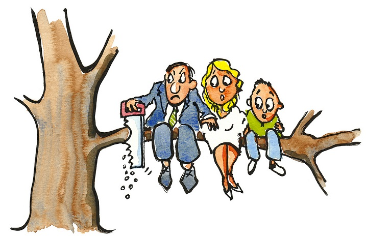

## **INTRODUCTION**
(importance of good decisions)

# **DATA WAREHOUSE CONCEPTS**

## **__what is a data warehouse?__**

A data warehouse is a centralised store of data from the transactional and operational systems used by the various departments of an organisation to process their day-to-day activities. 

## benefits of a data warehouse

- Data integration   

- Manage risk 

- Historical data 

- Quick access to data

- Better decision-making 

## ETL Functions

- Extract
- Transform
- Load

## __Data Lineage__

Trusting Big Data requires understanding its Data Lineage. Without Data Lineage, Big Data becomes synonymous with the last phrase in a game of telephone. 
Data Lineage describes data origins, movements, characteristics, and quality.

## __Temporal Data__

what is Temporal data?

Temporal data is simply data that represents a state in time.
A temporal database is a database that has certain features that support time-sensitive status for entries. 

## __What is Apache Camel?__

Apache Camel is a powerful open source integration platform based on Enterprise Integration Patterns (EIP) with powerful Bean Integration. Camel lets you implementing EIP routing using Camels intuitive Domain Specific Language (DSL)based on Java (aka fluent builder) or XML. Camel uses URI for endpoint resolution so its very easy to work with any kind of transport such as HTTP, REST, JMS, web service, File, FTP, TCP,Mail, JBI, Bean (POJO) and many others.

## enterprise integration patterns slide

## facts and dimensions slide

one of the attributes of a Dimentional Model is that it contains
facts and dimensions 

what is fact?

- table containing measurements
- grain defined by related dimensions
- usually additive, but not always
- resolves many-to-many relationships

## last slide

> with a quote to go.

my notes on 